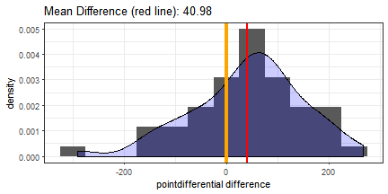

## Peer Graded Assignment 3:
### Analyzing Winning Super Bowl Teams
Dan Brusic  
February 2018

---

## Purpose and Use
The super bowl winners app ([link](https://dbrusic.shinyapps.io/superbowlWinners/)) is intended to be a platform for the user to:

1. analyze differences in individual statistics between winning and losing super bowl teams, 
2. identify meaningful statistics that potentially have predictive value,
3. and examine which statistics winning teams have been better at over different time periods (for example, in recent years teams tend to pass the ball more than in the past so passing stats may be more important).

--- 

## Interpretation of Statistics

* The app explores 18 different statistics (collected from [Pro Football Reference](https://www.pro-football-reference.com/) and the NFL's [website](https://www.nfl.com/)) found in the drop-down list on the app page. These stats were collected for all 104 teams that have played in super bowls 1 to 52 (winners and losers). 

* Offensive and defensive stats are categorized with an "O" and a "D" respectively. 

* Defensive stats represent what the team's defense allowed opposing offenses to get (yards, touchdowns).

* The numbers used for the app are the differences in each stat between the winner and loser of each of the 52 super bowls (winner - loser). 

---

## Example

* We want to analyze which stats are consistently different in favor of the winning teams. Further explanation of the plots and stats can be found on the app's webpage under the "App Description" tab.

* As an example, we can look at the difference in point differential for all years (1966 - 2017) between the winning and losing teams.


```r
y1 = sbTeams_winners[,"pointdifferential"]
y2 = sbTeams_losers[,"pointdifferential"]
test = t.test(y1, y2, paired = TRUE)
```
* The p-value for the paired t-test for point differential for all years is 0.0093205

---

## Example Continued

* Furthermore, the histogram of the differences (for point differential) shows that the mean is positive.



* Conclusion: winning super bowl teams have averaged a better point differential than their super bowl opponents during the regular season and the difference is significantly different than zero (p-value < 0.05)
